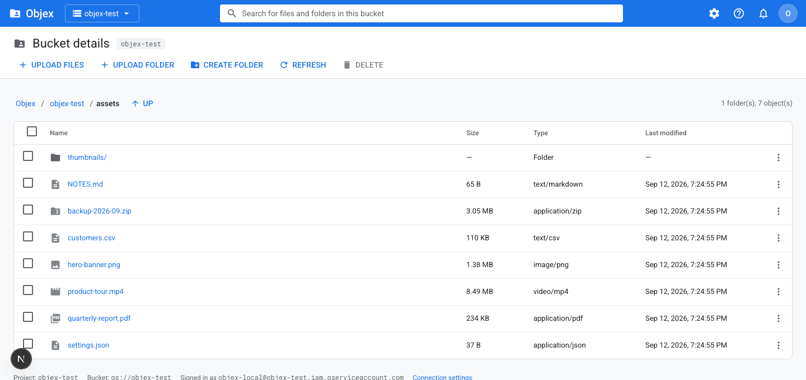
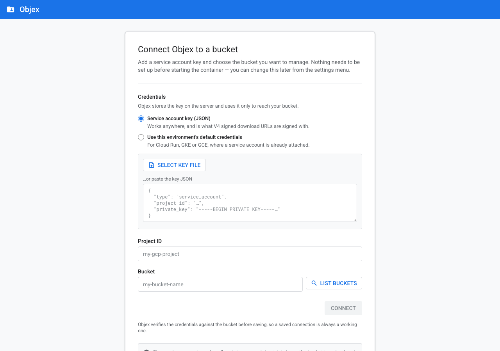

<h1 align="center">Objex</h1>

<p align="center">
  A self-hosted file manager for your Google Cloud Storage buckets —<br>
  the Google Cloud Console's look, with only the file operations.
</p>

<p align="center">
  
  
  
  
  
  
</p>



Objex gives non-technical users a familiar way to work with GCS buckets. It reproduces the Cloud
Console's interface — Roboto, Material icons, the `#1a73e8` app bar, the same table density — but
exposes **only list, upload, download and delete** (plus folder creation). No IAM screens, no
lifecycle rules, no billing, nothing to misconfigure.

You browse **one bucket at a time** and switch between them from the header; buckets you open are
remembered, and any other can be added by name. A deployment can also be pinned to exactly one
bucket with an environment variable, which hides the switcher entirely.

**Nothing needs to be configured before you start it.** Launch the container, open it in a browser,
paste a service account key and pick a bucket. Objex verifies the credentials against the bucket
before saving them.

<p align="center">
  
</p>

## Contents

- [Features](#features)
- [Stack](#stack)
- [Quick start](#quick-start)
- [Using Objex](#using-objex)
- [Preparing Google Cloud](#preparing-google-cloud)
- [Deployment](#deployment)
- [Configuration](#configuration)
- [Security](#security)
- [API reference](#api-reference)
- [How folders work](#how-folders-work)
- [Project structure](#project-structure)
- [Local development](#local-development)
- [Troubleshooting](#troubleshooting)
- [Contributing](#contributing)
- [License](#license)

## Features

- **Browse** a bucket as folders, not a flat object list — listing uses the GCS `delimiter`
  parameter, so you navigate one level at a time however many objects the bucket holds.
- **Upload** files or whole folders (directory structure preserved), with drag-and-drop and a live
  progress snackbar. Uploads stream straight into GCS rather than buffering in the server.
- **Download** through V4 signed URLs — bytes go directly from Cloud Storage to the browser, never
  through the container.
- **Delete** objects or entire folder prefixes, always behind a confirmation dialog that lists the
  exact targets.
- **Create folders**, **search** the current folder, and **switch between buckets** from the
  header — buckets you open are remembered, and any other can be added by name.
- **Configure it in the browser** — no environment variables or mounted key files required, though
  both are supported as overrides for automated deployments.
- **One small container** — a ~190 MB multi-stage image running as a non-root user.

## Stack

| Layer | Choice |
| --- | --- |
| Frontend | Next.js 15 (App Router), React 19, Tailwind CSS 3 |
| Icons / type | Google Material Icons, Roboto |
| Backend | Next.js Route Handlers (Node.js runtime) |
| GCS access | `@google-cloud/storage` v7 |
| Container | Multi-stage Dockerfile (`output: 'standalone'`), Docker Compose |

## Quick start

Requires [Docker](https://docs.docker.com/get-docker/) and a GCS bucket with a service account key
(see [Preparing Google Cloud](#preparing-google-cloud)).

```bash
git clone https://github.com/malhussin/Objex.git
cd Objex
docker compose up --build
```

Open <http://localhost:3000> and fill in the setup screen:

1. **Credentials** — select or paste your service account key JSON. (On Cloud Run, GKE or GCE you
   can instead choose *Use this environment's default credentials*.)
2. **Project ID** — filled in automatically from the key.
3. **Bucket** — type the name, or press **LIST BUCKETS** to choose from what the key can see.
4. **CONNECT** — Objex lists the bucket once to prove the credentials work, then saves them.

There is no `.env` file to create and no key file to mount. The connection is stored in the
`objex-config` Docker volume, so it survives restarts:

```bash
docker compose down          # keeps the saved connection
docker compose down -v       # forgets it; next start shows the setup screen again
```

## Using Objex

### Navigating

Click a **folder name** to go into it. The current path is kept in the URL
(`?prefix=assets/2026/`), so browser Back/Forward and bookmarks work. The breadcrumb trail
(`Objex / my-bucket / assets / 2026`) jumps to any level, and **UP** goes one level up.

The **search box** in the header filters the current folder by name. It does not search the whole
bucket — it narrows what you are looking at.

### Uploading

| Action | What it does |
| --- | --- |
| **+ UPLOAD FILES** | Pick one or more files; they land in the folder you are viewing. |
| **+ UPLOAD FOLDER** | Pick a directory; its internal structure is recreated under the current prefix. |
| **Drag and drop** | Drop files anywhere on the table to upload them into the current folder. |

A snackbar in the bottom-left shows live progress and reports success or the specific failure.
Large uploads are fine — the request streams to GCS, and the route allows up to 300 seconds.

### Downloading

Click a **file name**, or use **Download** in the row's ⋮ menu. Objex requests a 15-minute V4
signed URL and the browser fetches the object straight from Cloud Storage, so download speed is
unaffected by where Objex runs.

### Creating folders

**CREATE FOLDER** writes a zero-byte object whose name ends in `/` — the same convention the Cloud
Console uses. See [How folders work](#how-folders-work).

### Deleting

Tick any checkbox and **DELETE** activates; the header checkbox selects everything in view and
supports a partial-selection state. The confirmation dialog lists exactly what will go, and calls
out folders separately because deleting one removes everything beneath it. Single items can also be
deleted from the ⋮ menu.

> Deletes are permanent unless the bucket has
> [object versioning](https://cloud.google.com/storage/docs/object-versioning) enabled. Objex has no
> trash and no undo.

### Switching and adding buckets

The selector next to the Objex wordmark holds every bucket you have opened, plus any others the
credentials can enumerate. Picking one switches to it and drops you at its root.

- **Add another bucket…** at the bottom of the menu takes a bucket name directly. Use it for a
  bucket in a different project, or when the service account has no permission to list buckets.
  Objex verifies it can read the bucket before switching, so a typo or a missing grant fails with a
  specific message and changes nothing.
- **Every bucket that verifies is remembered**, so it stays in the menu afterwards — this is what
  makes the switcher useful for a service account scoped to individual buckets, which cannot
  enumerate anything.
- **✕ next to a remembered bucket removes it from the list only.** The bucket and its contents in
  Cloud Storage are untouched. The bucket you are currently in cannot be removed; switch away
  first.

Objex works in one bucket at a time — the list is a set of shortcuts, not simultaneous
connections. It lives in the same config file as the rest of the connection, so it survives
restarts, and the whole switcher is disabled when `GCP_BUCKET_NAME` pins the bucket.

### Changing the connection

The **gear icon** (or the account menu) opens **Connection settings**, where you can change the
bucket, replace the service account key, or **DISCONNECT** — which erases the stored key and returns
Objex to its setup screen.

## Preparing Google Cloud

Create a service account and grant it access to the buckets you want to manage. Replace
`PROJECT_ID` and `BUCKET_NAME`:

```bash
# 1. Create the service account
gcloud iam service-accounts create objex \
  --project PROJECT_ID \
  --display-name "Objex file manager"

# 2. Let it read and write objects in a bucket
#    (repeat this for every bucket you want to manage)
gcloud storage buckets add-iam-policy-binding gs://BUCKET_NAME \
  --member "serviceAccount:objex@PROJECT_ID.iam.gserviceaccount.com" \
  --role roles/storage.objectAdmin

# 3. Create a key to paste into the setup screen
gcloud iam service-accounts keys create objex-key.json \
  --iam-account objex@PROJECT_ID.iam.gserviceaccount.com
```

**Roles**

- `roles/storage.objectAdmin` on a bucket covers everything Objex does there; grant it on each
  bucket you want to manage. `roles/storage.objectViewer` is enough for read-only use, but upload,
  folder creation and delete will fail.
- The **LIST BUCKETS** dropdown additionally needs the project-level `storage.buckets.list`
  permission (included in `roles/storage.admin`). Without it, Objex says so and you type the bucket
  name instead — everything else still works.

**Signed downloads** need a private key to sign with:

- **With a key file, or a key pasted into the UI**, signing happens locally. Nothing extra is
  required.
- **With an attached service account and no key** (Cloud Run, GKE), the client signs through the IAM
  API, so the service account needs `roles/iam.serviceAccountTokenCreator` **on itself**:

  ```bash
  gcloud iam service-accounts add-iam-policy-binding \
    objex@PROJECT_ID.iam.gserviceaccount.com \
    --member "serviceAccount:objex@PROJECT_ID.iam.gserviceaccount.com" \
    --role roles/iam.serviceAccountTokenCreator
  ```

  Without it, only `/api/download` fails; every other screen keeps working.

Treat `objex-key.json` as a secret and delete it once pasted. `.gitignore` and `.dockerignore`
already exclude `google-credentials.json` and the local config directory.

## Deployment

Objex is a standard Next.js app in a single container. It listens on `PORT` (default `3000`) and
needs one writable directory, `/app/data`, **only** if you want a connection entered in the browser
to survive restarts.

### Docker Compose (recommended for a VM or home server)

[`docker-compose.yml`](docker-compose.yml) needs no edits:

```bash
docker compose up -d --build
```

It publishes port 3000, mounts the `objex-config` volume at `/app/data`, and health-checks
`/api/health`. Optional settings are listed, commented out, in the file.

### Plain Docker

```bash
docker build -t objex .
docker volume create objex-config
docker run -d --name objex \
  -p 3000:3000 \
  -v objex-config:/app/data \
  --restart unless-stopped \
  objex
```

To skip the setup screen entirely, supply everything through the environment instead:

```bash
docker run -d --name objex \
  -p 3000:3000 \
  -v /etc/objex/google-credentials.json:/secrets/key.json:ro \
  -e GOOGLE_APPLICATION_CREDENTIALS=/secrets/key.json \
  -e GCP_PROJECT_ID=my-project \
  -e GCP_BUCKET_NAME=my-bucket \
  objex
```

### Google Cloud Run

> **Important:** Cloud Run instances have an ephemeral, per-instance filesystem. A connection saved
> through the setup screen is lost when the instance is recycled and is not shared between
> instances. **On Cloud Run, configure Objex with environment variables** and let it use the attached
> service account for credentials.

```bash
gcloud run deploy objex \
  --source . \
  --region europe-west1 \
  --service-account objex@PROJECT_ID.iam.gserviceaccount.com \
  --set-env-vars GCP_BUCKET_NAME=BUCKET_NAME,GCP_PROJECT_ID=PROJECT_ID \
  --no-allow-unauthenticated
```

`--source .` builds the included `Dockerfile` with Cloud Build. Cloud Run injects its own `PORT`,
which the image honours. Because Objex has no user accounts of its own, deploy it **private**
(`--no-allow-unauthenticated`) and reach it through a tunnel:

```bash
gcloud run services proxy objex --region europe-west1    # then open http://localhost:8080
```

For a shared internal deployment, put
[Identity-Aware Proxy](https://cloud.google.com/iap/docs/enabling-cloud-run) or another
authenticating layer in front of it. Also grant the service account
`roles/iam.serviceAccountTokenCreator` on itself so signed downloads work — see
[Preparing Google Cloud](#preparing-google-cloud).

### Kubernetes and other platforms

The same rule applies anywhere instances are replaceable or replicated: either mount a persistent
volume at `/app/data` (single replica), or configure `GCP_BUCKET_NAME`, `GCP_PROJECT_ID` and
credentials through the environment and treat the container as stateless. On GKE with Workload
Identity, leave credentials unset and let the pod's service account supply them.

### Behind a reverse proxy

Objex speaks plain HTTP on one port. When proxying it:

- Raise the request body limit and timeouts to match the uploads you expect — nginx defaults
  `client_max_body_size` to 1 MB and will otherwise reject files.
- Terminate TLS at the proxy. The stored service account key and everything you browse should not
  cross a network in the clear.
- Add authentication there. This is the recommended way to control who reaches Objex.

## Configuration

Every setting is optional. Objex resolves each one independently: **an environment variable wins if
it is set, otherwise the value entered in the UI is used.** A field pinned by the environment is
shown read-only in the settings form, marked *managed by environment*.

| Variable | Purpose |
| --- | --- |
| `GCP_BUCKET_NAME` | Pin the bucket. The settings field becomes read-only and the header switcher is disabled. |
| `GCP_PROJECT_ID` | Pin the project that owns the bucket. |
| `GOOGLE_APPLICATION_CREDENTIALS` | Path to a mounted service account key, instead of one entered in the UI. Leave unset on GCP to use the attached service account. |
| `OBJEX_ADMIN_TOKEN` | Require this token before the connection can be changed. See [Security](#security). |
| `OBJEX_CONFIG_PATH` | Where a UI-entered connection is written. Defaults to `./.objex/config.json`; the image sets `/app/data/objex-config.json`. |
| `PORT` | Port to listen on. Defaults to `3000`. |

[`.env.example`](.env.example) documents the same list. With Docker Compose, a `.env` file next to
`docker-compose.yml` is picked up automatically.

## Security

**Objex has no user accounts.** Anyone who can reach it can browse, upload and delete objects in the
configured bucket and — unless you set an admin token — change the connection. This is deliberate:
it is built to sit on a laptop, on a private network, or behind an authenticating proxy.

Before exposing it to anyone else:

1. **Put an authenticating layer in front** — IAP, an OAuth proxy, a VPN, or your reverse proxy's
   own auth. Objex cannot do this for you.
2. **Set `OBJEX_ADMIN_TOKEN`** so the connection cannot be repointed or erased by visitors:

   ```yaml
   environment:
     OBJEX_ADMIN_TOKEN: a-long-random-string
   ```

   `POST`/`DELETE /api/config` and `POST /api/buckets` then require the token (compared in constant
   time), and the settings form asks for it. Switching bucket from the header is a config write, so
   with a token set it must be done through **Connection settings**.
3. **Grant the service account only the buckets it needs**, with `roles/storage.objectAdmin` on
   each, rather than project-wide storage admin. Objex only ever touches the bucket it is pointed
   at, but the key is only as limited as you make it — and anyone using Objex can point it at any
   bucket that key can reach.

How the key is handled:

- It is stored server-side at `OBJEX_CONFIG_PATH`, written `0600` and owned by the container's
  non-root user.
- It is **never** returned to the browser. `GET /api/config` reports only the service account email
  and the last six characters of the key id.
- It is never baked into the image; `.dockerignore` excludes credential files and the config
  directory.
- Anything holding that volume — or a backup of it — holds a usable GCS credential. Treat it as a
  secret, and use **DISCONNECT** to erase it.

## API reference

All routes run on the Node.js runtime and are dynamic. Every path is normalized server-side:
absolute paths, `..` segments and control characters are rejected before reaching GCS. The four data
routes answer `409 { "needsSetup": true }` until a connection is configured, which is how the UI
knows to show the setup screen.

### `GET /api/files?prefix={path}`

Lists one directory level. `delimiter: '/'` is passed to GCS, so subfolders come back as prefixes
rather than every object in the bucket.

```jsonc
{
  "bucket": "my-bucket",
  "prefix": "assets/",
  "folders": [{ "kind": "folder", "name": "thumbnails", "path": "assets/thumbnails/" }],
  "files": [
    {
      "kind": "file",
      "name": "hero-banner.png",
      "path": "assets/hero-banner.png",
      "size": 1450008,
      "contentType": "image/png",
      "updated": "2026-09-12T15:26:17.000Z",
      "storageClass": "STANDARD",
      "generation": "1789226693722012"
    }
  ],
  "nextPageToken": null
}
```

### `POST /api/upload` (`multipart/form-data`)

| Field | Meaning |
| --- | --- |
| `prefix` | Destination directory, `''` for the bucket root |
| `files` | One or more file parts |
| `paths` | Optional, one per file in the same order — carries `webkitRelativePath` so **UPLOAD FOLDER** preserves the tree |

Each part is streamed into GCS (`Readable.fromWeb` → `createWriteStream`). The browser reports
progress with `XMLHttpRequest.upload.onprogress`. Returns `201` with the object paths written.

### `GET /api/download?file={path}`

Returns a **V4 signed URL** (`GOOG4-RSA-SHA256`, 15-minute expiry,
`Content-Disposition: attachment`).

```jsonc
{
  "url": "https://storage.googleapis.com/my-bucket/assets/report.pdf?X-Goog-Algorithm=...",
  "path": "assets/report.pdf",
  "filename": "report.pdf",
  "expiresAt": "2026-09-12T15:40:48.720Z"
}
```

### `POST /api/delete`

```jsonc
{ "paths": ["assets/old.png", "assets/thumbnails/"] }
```

A path ending in `/` is a folder: everything under that prefix is removed recursively, then the
placeholder itself. Returns per-path results, and `207` when some paths failed while others
succeeded.

### `POST /api/folder`

```jsonc
{ "prefix": "assets/", "name": "thumbnails" }
```

### `GET /api/config`

What Objex is connected to. The private key is never included.

```jsonc
{
  "configured": true,
  "bucketName": "my-bucket",
  "projectId": "my-gcp-project",
  "credentials": {
    "source": "stored-key",          // or "env-file" | "ambient"
    "clientEmail": "objex@my-gcp-project.iam.gserviceaccount.com",
    "privateKeyIdSuffix": "9f21ac"
  },
  "knownBuckets": ["archive-2026", "my-bucket"],
  "managedBy": { "bucketName": "app", "projectId": "app", "credentials": "app" },
  "adminTokenRequired": false,
  "updatedAt": "2026-09-12T15:53:22.232Z"
}
```

### `POST /api/config`

Saves the connection entered in the setup screen.

```jsonc
{
  "bucketName": "my-bucket",
  "projectId": "my-gcp-project",          // optional, taken from the key otherwise
  "credentialsMode": "key",               // or "ambient"
  "serviceAccountKey": "{ …key JSON… }",  // string or object; omit with keepExistingKey
  "keepExistingKey": false
}
```

The credentials are tested against the bucket **before** anything is written, so a saved
configuration is always a working one. A failed check returns `400` with a specific reason and
changes nothing on disk. Requires `x-objex-admin-token` when `OBJEX_ADMIN_TOKEN` is set.

### `DELETE /api/config`

Forgets the saved connection, including the stored key. Environment-provided values are untouched;
`stillConfiguredByEnvironment` in the response says whether Objex remains usable without it.

### `POST /api/buckets`

Buckets a credential set can see. Send `{ serviceAccountKey, projectId }` to probe a key before
saving it, or `{}` to use the saved one. Listing needs project-level `storage.buckets.list`; without
it the response is `{ "listable": false, "reason": "…" }` and the UI falls back to the remembered
list plus **Add another bucket…**.

### `DELETE /api/buckets?name={bucket}`

Removes one bucket from the remembered list returned as `knownBuckets`. This edits Objex's own
configuration only — **nothing in Cloud Storage is deleted**. Refuses to remove the bucket currently
in use, and requires `x-objex-admin-token` when `OBJEX_ADMIN_TOKEN` is set.

### `GET /api/health`

Liveness probe used by the Compose healthcheck. Reports whether setup has been completed; it never
contacts GCS, so an unconfigured container is still healthy and can serve its setup screen.

## How folders work

Cloud Storage has no directories, only object names containing `/`. Objex handles this the way the
Cloud Console does:

- **Listing** passes `delimiter: '/'`, so GCS returns the objects at the current level plus the
  distinct sub-prefixes. Each prefix renders as a folder row.
- **Creating** a folder writes a zero-byte object whose name ends in `/`. It appears as a prefix and
  is filtered out of its own listing, so it never shows up as a phantom row.
- **Deleting** a folder deletes every object under the prefix, then the placeholder.

A "folder" therefore exists only as long as something is named inside it — exactly as in the Cloud
Console.

## Project structure

```text
src/
├── app/
│   ├── layout.js              # Roboto + Material Icons, global CSS
│   ├── page.js                # setup screen or browser, depending on the saved connection
│   ├── globals.css            # the GCP design system as Tailwind component classes
│   └── api/
│       ├── files/route.js     # GET    list one directory (delimiter: '/')
│       ├── upload/route.js    # POST   streaming multipart upload
│       ├── download/route.js  # GET    V4 signed URL
│       ├── delete/route.js    # POST   objects and recursive prefixes
│       ├── folder/route.js    # POST   zero-byte folder placeholder
│       ├── config/route.js    # GET/POST/DELETE the in-app connection
│       ├── buckets/route.js   # POST   buckets a credential set can see
│       └── health/route.js    # GET    container healthcheck
├── components/
│   ├── ObjexBrowser.jsx       # client orchestrator: state, fetching, uploads, toasts
│   ├── SetupScreen.jsx        # first-run screen wrapping ConnectionForm
│   ├── ConnectionForm.jsx     # key / project / bucket entry, reused in the settings dialog
│   ├── Header.jsx             # blue app bar: brand, bucket switcher, search, settings, avatar
│   ├── ActionBar.jsx          # bucket name + UPLOAD / CREATE FOLDER / REFRESH / DELETE
│   ├── Breadcrumbs.jsx        # Objex / bucket / folder / subfolder
│   ├── FileTable.jsx          # Material data table + per-row ⋮ menu
│   ├── Snackbar.jsx           # bottom-left toasts with upload progress
│   ├── Dialog.jsx             # modal shell
│   ├── CreateFolderDialog.jsx
│   ├── DeleteDialog.jsx
│   └── Icon.jsx               # Material Icons ligature wrapper
└── lib/
    ├── config.js              # stored connection, env precedence, redaction, admin token
    ├── gcs.js                 # Storage clients per credential set, path sanitizing, probes
    ├── errors.js              # error types and their HTTP mapping
    └── format.js              # byte/date formatting, content-type icons, breadcrumbs
```

Design tokens live in [tailwind.config.js](tailwind.config.js) (`gcp.blue`, `gcp.border`,
`gcp.canvas`, the 12/13/14px type scale); the Material button, checkbox, menu and input classes are
in [src/app/globals.css](src/app/globals.css).

## Local development

```bash
npm install
npm run dev          # http://localhost:3000, then use the setup screen
```

| Script | Purpose |
| --- | --- |
| `npm run dev` | Development server with hot reload |
| `npm run build` | Production build (`output: 'standalone'`) |
| `npm start` | Serve the production build |

The connection you enter is saved to `./.objex/config.json` (git-ignored); delete that file to get
the setup screen back. Do not run `npm run build` while `npm run dev` is running — the production
build overwrites the dev server's `.next` output.

## Troubleshooting

**The setup screen keeps coming back** — the connection is not being persisted. Check that
`/app/data` is a writable volume. On Cloud Run and other ephemeral platforms this is expected:
configure Objex with environment variables instead ([Deployment](#deployment)).

**"Bucket … does not exist, or belongs to another project"** — shown while connecting: wrong bucket
name, or the key belongs to another project. Nothing is saved until this passes.

**403 on upload or delete** — the service account needs `roles/storage.objectAdmin` on the bucket.

**LIST BUCKETS says listing is not permitted** — expected for a bucket-scoped service account. Type
the bucket name instead; everything else works.

**Downloads fail with a signing error** — you are running with an attached service account and no key
file. Grant `roles/iam.serviceAccountTokenCreator` on itself
([Preparing Google Cloud](#preparing-google-cloud)).

**Large uploads fail behind a proxy** — raise the proxy's body-size limit and timeouts. The upload
route itself allows up to 300 seconds.

**"Incorrect admin token"** — `OBJEX_ADMIN_TOKEN` is set on the server; enter it in the settings form
to change the connection.

## Contributing

Issues and pull requests are welcome.

```bash
npm install
npm run dev
npm run build    # make sure it compiles before opening a PR
```

Conventions worth keeping: no environment-specific branches in `src/`; every path from the browser
goes through `sanitizeObjectPath`; the service account key never reaches the client; and UI colours
and spacing come from the Tailwind `gcp.*` tokens rather than ad-hoc values.

## License

[MIT](LICENSE) © malhussin

---

Objex is an independent project, not affiliated with or endorsed by Google. "Google Cloud Storage"
and the Cloud Console's visual design are property of Google LLC.
